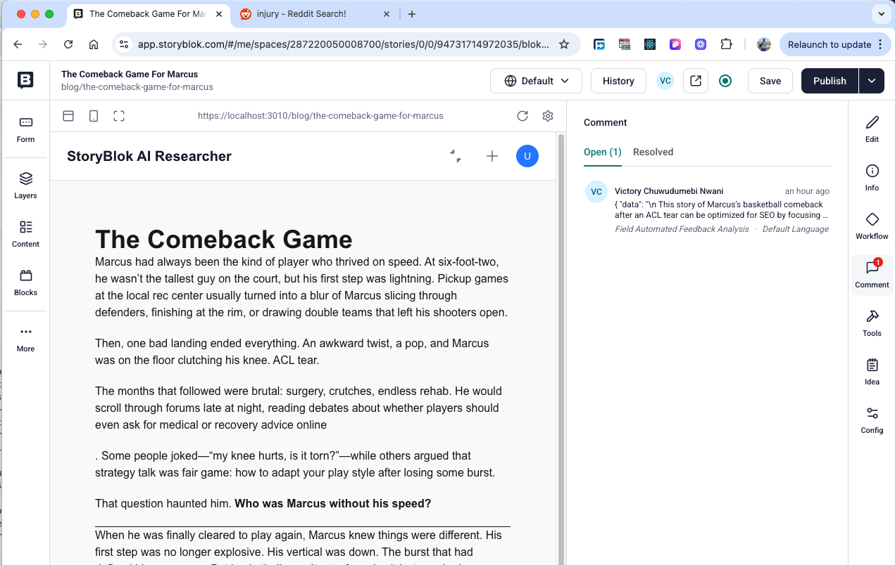

# StoryBlok Reddit Content Feedback

AI-powered tool for content feedback enriched with insights from Reddit discussions. It analyses discussions relevant to your topic area in subreddits to extract SEO keywords, emerging trends, sentiments, more areas to write about which are all useful for more impact on your readers.

## Inspiration

> This project is currently being built during the [Storyblok x Code and Coffee Hackathon 2025](https://storyblok-code-coffee.devpost.com/) event.

While working with content writers, I’ve observed that they often turn to replies, comments and posts within subreddits on Reddit to gain authentic insights into industry challenges, user pain points, and product experiences to measure the impact of what they're writing about.

### Challenge

Manually reading through tens to hundreds of comments and posts within subreddits on Reddit is quite exhausting and you tend to miss alot of information while glossing through hundreds of conversations.

### Solution

I built a Next.js web application that connects to the Storyblok Management API to pull stories from a Storyblok space. Each story is then processed by an OpenAI LLM via Next.js route handlers, which use function calling to fetch live Reddit data related to the topic. The model reviews the story with the Reddit data in context and provides actionable feedback on how to improve the content.

This application is currently serverless without storing your StoryBlok and OpenAI credentials. The credentials provided are stored in a local Zustand state and are cleared when your refresh the window.

## Tool Demo

<iframe src="https://www.loom.com/embed/3c01c99442e44544872f3a31cc8c50ed?sid=18f8629f-79f6-489c-aaa8-0e8dbbb83c34" frameborder="0" webkitallowfullscreen mozallowfullscreen allowfullscreen style="position: absolute; top: 0; left: 0; width: 100%; height: 100%;"></iframe>

## User flow

- Configure StoryBlok and OpenAI credentials.
- Read a StoryBlok story
- Extract plain text from the story object and recommend relevant subbreddits to post the story or get usefull insights.
- Sentiment analysis against the story based on crawled description from the relevant subbreddits.
- Create a discussion and comment within the story.

## Technologies

- StoryBlok CMS Editor
- StoryBlok Management API
- OpenAI
- React / Next.js / Next.js Route Handlers for edge functions.
- Vercel AI
- Reddit

## Screenshots

    <figure style="margin:0;overflow:hidden;border-radius:8px;background:#ddd;">
        
        <figcaption style="padding:4px;font-size:13px;">Landing page</figcaption>
    </figure>
    <figure style="margin:0;overflow:hidden;border-radius:8px;background:#ddd;">
        
        <figcaption style="text-align:center; padding:4px;font-size:13px;">API Configuration Step</figcaption>
    </figure>
    <figure style="margin:0;overflow:hidden;border-radius:8px;background:#ddd;">
        
        <figcaption style="text-align:center; padding:4px;font-size:13px;">Select A Story</figcaption>
    </figure>
     <figure style="margin:0;overflow:hidden;border-radius:8px;background:#ddd;">
        
        <figcaption style="text-align:center; padding:4px;font-size:13px;">Stories Dropdown</figcaption>
    </figure>
    <figure style="margin:0;overflow:hidden;border-radius:8px;background:#ddd;">
        
        <figcaption style="text-align:center; padding:4px;font-size:13px;">Generate subreddit suggestions</figcaption>
    </figure>
    <figure style="margin:0;overflow:hidden;border-radius:8px;background:#ddd;">
        
        <figcaption style="text-align:center; padding:4px;font-size:13px;">View extracted text, add or remove subreddit suggestions</figcaption>
    </figure>
     <figure style="margin:0;overflow:hidden;border-radius:8px;background:#ddd;">
        
        <figcaption style="text-align:center; padding:4px;font-size:13px;">Generate feedback based on your story with Reddit data in context window</figcaption>
    </figure>
     <figure style="margin:0;overflow:hidden;border-radius:8px;background:#ddd;">
        
        <figcaption style="text-align:center; padding:4px;font-size:13px;">View generated content feedback</figcaption>
    </figure>
     <figure style="margin:0;overflow:hidden;border-radius:8px;background:#ddd;">
        
        <figcaption style="text-align:center; padding:4px;font-size:13px;">Start StoryBlok Discussion based using generated feedback</figcaption>
    </figure>

## Todo

- [ ] Implement user authentication.
- [ ] Support persisting of application credentials based on user preference.
- [ ] Introduce sufficient E2E and Unit tests.
- [ ] Build simple landing page or write blog post detailing the tool features.

## Contributing

Please feel free to fork this package and contribute by submitting a pull request to enhance the functionalities.

## How can I thank you?

Why not star the github repo? I'd love the attention! Why not share the link for this repository on Twitter or HackerNews? Spread the word!

Don't forget to follow and connect with me on [Twitter](https://x.com/iamnwani) and [Linkedln](https://www.linkedin.com/in/victory-nwani/)!
